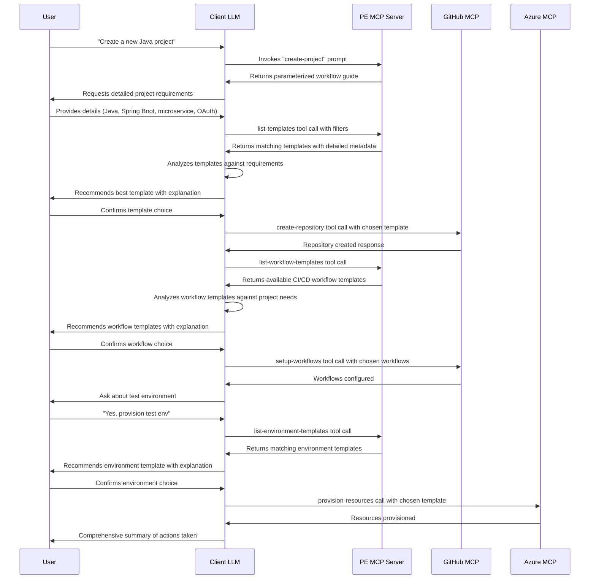

# Agentic Platform Engineering with GitHub Copilot, Azure & MCP

This guide outlines an architecture for leveraging the Model Context Protocol (MCP) to create a powerful Platform Engineering experience through AI agents. By combining MCP's tools, prompts, and client-server architecture, we can create seamless, standardized workflows that automate complex platform engineering tasks while maintaining the human-in-the-loop element essential for critical decisions.

Create your .env file based on .env.example and then run locally with MCP Inspector as: 

```bash
npm install
npm run build
npx env-cmd -f .env npx @modelcontextprotocol/inspector node dist/server.js
```

## 1. Architecture Overview

The architecture consists of three primary components:

1. **Client LLM Interface**: The entry point for users (GitHub Copilot in VS Code or GitHub.com)
2. **PE MCP Server**: The orchestration layer that defines workflows and exposes platform engineering capabilities
3. **Product-specific MCP Servers**: Specialized servers for GitHub, Azure, and other tools


## 2. Detailed Workflow Sequence

This sequence diagram demonstrates how the Platform Engineering system leverages the Model Context Protocol (MCP) to create a structured interaction between LLMs and platform tooling. The workflow follows MCP's key architectural principles:
<br><br>

<br>

1. **Prompts as Workflow Templates**: The PE MCP Server defines standardized prompt templates that guide both the LLM and user through complex platform engineering tasks. These prompts surface as discoverable, interactive elements.

   When a prompt is returned to the LLM, it includes structured guidance that helps the LLM:
   - Break down complex tasks into discrete steps
   - Select appropriate MCP tools from different servers (GitHub MCP, Azure MCP, etc.)
   - Maintain context across multiple tool invocations
   - Follow standardized workflows while adapting to specific requirements
   - Know when to seek user confirmation for critical decisions

2. **Tools for Concrete Actions**: Each action (creating repositories, configuring workflows, provisioning resources) is implemented as an MCP tool with well-defined parameters and validation, allowing the LLM to execute operations securely.

3. **Client-Server Architecture**: Following MCP's design, each service (PE, GitHub, Azure) runs as a separate server that exposes its capabilities through prompts and tools. The Client LLM acts as the coordinator, maintaining individual connections with each server.

4. **Human-in-the-Loop Control**: The workflow preserves MCP's human oversight model - all key decisions (template selection, workflow choices, environment provisioning) require explicit user confirmation before tools are invoked.

This approach ensures standardization while maintaining MCP's security principles and keeping humans in control of critical platform engineering decisions.

## 4. Configuration Repository

The PE MCP Server reads from a central configuration repository that contains YAML files defining available templates such as: GitHub Repository templates, GitHub Actions workflow templates or Azure Deployment Environment templates:

```yaml
# templates.yaml
templates:
  repositories:
    - name: java-springboot-microservice
      description: "Spring Boot microservice with OAuth2 security and API documentation"
      url: "github.com/org/java-springboot-template"
      language: java
      framework: springboot
      architectureType: microservice
      features:
        - oauth2
        - swagger
        - actuator
      compliance:
        - soc2
      use-cases:
        - "Backend services requiring authentication"
      complexity: medium
      
  workflows:
    - organization: "my-org"
      include: 
       - 'java-ci-workflow'
      
    - organization: "my-org2"
      include:
       - '*'
      
  environments:
    - name: java-test-environment
      description: "Test environment for Java microservices with database and monitoring"
      language: java
      resources:
        - kubernetes-namespace
        - postgres-database
        - prometheus-monitoring
```

## 3. MCP Components and Their Value

### 3.1 MCP Prompts: Guided Workflows

MCP Prompts are essential for providing structured guidance to both the user and the LLM:

1. **Value in Platform Engineering**:
   - **Workflow Standardization**: Prompts define consistent workflows across the organization
   - **Guided Experience**: Step-by-step templates guide users through complex processes
   - **Context Preservation**: Maintain context throughout multi-step processes
   - **Discoverability**: Prompts appear as slash commands in supporting clients

2. **Implementation Approach**:
   - Define high-level workflow prompts that outline the entire process
   - Include dynamic parameters based on user requirements
   - Structure prompts as conversations that guide both user and LLM
   - Design prompts to anticipate common decision points

### 3.2 MCP Tools: Executable Capabilities

MCP Tools enable concrete actions and information retrieval:

1. **Value in Platform Engineering**:
   - **Action Execution**: Perform operations on GitHub, Azure, and other systems
   - **Information Retrieval**: Fetch available templates and configuration options
   - **Standardization**: Ensure operations follow organization standards
   - **Security**: Properly scoped tools with parameter validation

## 4. Use Cases

### 4.1 New Project Creation

**Value Proposition**: Automate the creation of standardized, compliant projects in minutes instead of hours.

**Workflow**:
1. Developer expresses intent to create a new project
2. LLM gathers requirements through natural conversation
3. PE MCP Server provides appropriate templates based on requirements
4. LLM recommends best template and explains reasoning
5. Upon confirmation, GitHub MCP creates repository from template
6. LLM recommends appropriate CI/CD workflows from PE MCP Server
7. GitHub MCP configures workflows
8. LLM offers to provision test environment
9. Azure MCP provisions resources if requested

### 4.2 Environment Provisioning

**Value Proposition**: Standardize environment creation across teams with built-in compliance and best practices.

**Workflow**:
1. Developer requests environment for existing project
2. LLM determines project type and requirements
3. PE MCP Server provides appropriate environment templates
4. LLM recommends best template and explains reasoning
5. Upon confirmation, Azure MCP provisions resources
6. LLM summarizes provisioned resources and provides access information

## 5. Conclusion

The MCP-based Platform Engineering architecture offers a powerful way to combine AI-driven assistance with standardized platform operations. By leveraging MCP Prompts for workflow guidance and MCP Tools for concrete actions, while keeping humans in the loop for critical decisions, this approach balances automation with control.

The result is a platform that:
- Reduces the cognitive load on developers
- Enforces organizational standards and best practices
- Makes platform capabilities accessible through natural language
- Provides predictable, repeatable outcomes

## Contributing

This project welcomes contributions and suggestions.  Most contributions require you to agree to a
Contributor License Agreement (CLA) declaring that you have the right to, and actually do, grant us
the rights to use your contribution. For details, visit https://cla.opensource.microsoft.com.

When you submit a pull request, a CLA bot will automatically determine whether you need to provide
a CLA and decorate the PR appropriately (e.g., status check, comment). Simply follow the instructions
provided by the bot. You will only need to do this once across all repos using our CLA.

This project has adopted the [Microsoft Open Source Code of Conduct](https://opensource.microsoft.com/codeofconduct/).
For more information see the [Code of Conduct FAQ](https://opensource.microsoft.com/codeofconduct/faq/) or
contact [opencode@microsoft.com](mailto:opencode@microsoft.com) with any additional questions or comments.

## Trademarks

This project may contain trademarks or logos for projects, products, or services. Authorized use of Microsoft 
trademarks or logos is subject to and must follow 
[Microsoft's Trademark & Brand Guidelines](https://www.microsoft.com/en-us/legal/intellectualproperty/trademarks/usage/general).
Use of Microsoft trademarks or logos in modified versions of this project must not cause confusion or imply Microsoft sponsorship.
Any use of third-party trademarks or logos are subject to those third-party's policies.
