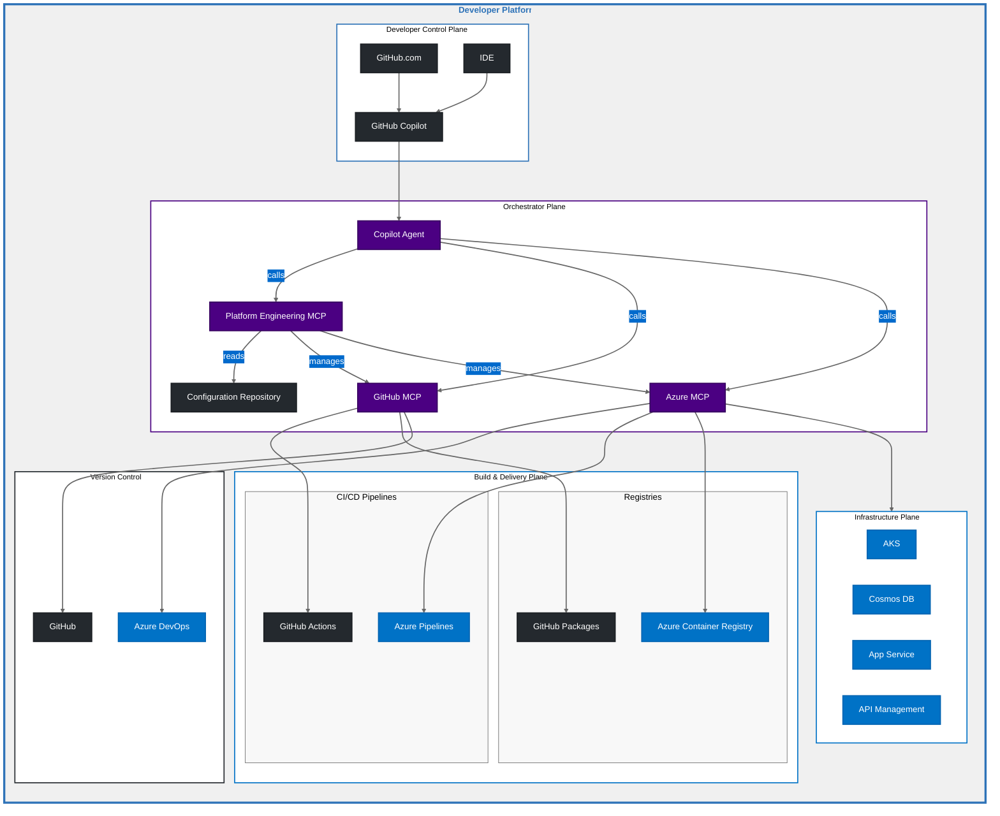

# Agentic Platform Engineering with GitHub Copilot, Azure & MCP

This document outlines an innovative Platform Engineering architecture that leverages GitHub Copilot's AI capabilities and Model Context Protocol (MCP) to create an intelligent, automated platform engineering experience. The architecture is designed to streamline the development process by exposing platform capabilities as tools that can be accessed through natural language interactions.

## 🏗️ Architecture Components

### 1. 👩‍💻 Developer Control Plane

The Developer Control Plane serves as the primary interface for developers to interact with the platform:

#### 🎯 Entry Points
  - 💻 VSCode with GitHub Copilot
  - 🌐 GitHub.com with GitHub Copilot

#### 🔄 Workflow Initiation
All through natural language interactions with GitHub Copilot, Developers can:
- 🆕 Request new project provisioning
- 🚀 Initiate application deployments
- ⚙️ Configure platform resources

### 2. 🧠 Orchestrator Plane

The Orchestrator Plane serves as the intelligent coordination layer, where MCP servers expose tools for the GitHub Copilot Agent to consume:

#### 🎮 Platform Engineering MCP Server
This MCP Server is central to the PE architecture. **It is the Developer 🛠️ High-Level Tool Provider**:
  - Exposes platform engineering tools to the Copilot Agent
  - Provides **high-level operations** like:
    * 📦 Project provisioning
    * 🌍 Environment creation
    * 🚀 Application deployment
    * 🏗️ Infrastructure setup
  - 🎯 Abstracts complexity of underlying tools
  - 📋 Maintains platform standards and best practices

#### 📝 Configuration Management
The PE MCP Server is grounded on customer specific configuration saved in a GitHub Repository which acts as **💾 Central Source of Truth**: 
    
- 📂 All platform configurations stored in a GitHub repository
- 🌟 Main branch serves as the single source of truth
- 🔄 PE MCP Server automatically pulls latest configurations
- 📜 Changes tracked and versioned through Git

### 3. 🔄 Integration and Delivery Plane

The Integration and Delivery Plane provides access to build and delivery capabilities through specialized products connected via their respective MCP Servers. Example: GitHub Actions and Azure Pipelines.

### 4. ☁️ Infrastructure Plane

The Infrastructure Plane exposes **Azure resources through the Azure MCP server's** tool collection:

- **💻 Compute Management**:
  - 🎮 AKS cluster operations
  - 📦 Container instance deployment
  - 🖥️ VM provisioning
  - ⚡ App Service configuration

- **🗄️ Data Services**:
  - 💾 Database provisioning
  - 📁 Storage account management
  - ⚡ Cache configuration
  - 💾 Backup and restore

- **🌐 Network Configuration**:
  - 🔌 Virtual network setup
  - 🚪 Gateway management
  - 🔍 DNS configuration
  - ⚖️ Load balancer provisioning

## 🔄 Tool-Driven Workflow Example

1. **💬 Developer Interaction**:
   - Developer expresses intent via natural language to GitHub Copilot
   - Example: "Create a new microservice project with a MongoDB database"

2. **🎯 Tool Selection and Orchestration**:
   - Copilot Agent interprets request and selects appropriate tools
   - Platform Engineering MCP provides high-level project creation tool
   - Tool executes standardized project setup workflow

3. **🏗️ Resource Provisioning**:
   - Platform Engineering MCP coordinates with product-specific MCPs
   - GitHub MCP tools create repository and configure workflows
   - Azure MCP tools provision infrastructure components
   - Azure DevOps MCP tools set up CI/CD pipelines

4. **⚙️ Configuration and Deployment**:
   - Tools apply standard configurations and security policies
   - Infrastructure is provisioned using validated templates
   - CI/CD pipelines are configured using best practices
   - Monitoring and logging are automatically set up

## ✨ Key Benefits

1. **🛠️ Tool-Driven Architecture**:
   - 📋 Standardized platform capabilities
   - 🎯 Consistent resource provisioning
   - 🤖 Automated best practices
   - ❌ Reduced human error

2. **💬 Natural Language Interface**:
   - 🗣️ Tools accessible through conversation
   - 🎯 Complex operations simplified
   - 📉 Reduced learning curve
   - 📈 Increased developer productivity

3. **🔒 Platform Governance**:
   - 🎮 Controlled tool access
   - 📋 Standardized configurations
   - ✅ Policy enforcement
   - 📝 Audit capabilities

4. **🔌 Extensibility**:
   - ➕ Easy addition of new tools
   - 🛠️ Custom tool creation
   - 🔗 Integration with new services
   - 🔄 Flexible platform evolution

This architecture represents a modern approach to platform engineering where platform capabilities are exposed as tools, accessible through natural language interactions with GitHub Copilot. This allows developers to focus on their intentions while the platform handles the complexity of execution through standardized, secure, and automated processes.

## Contributing

This project welcomes contributions and suggestions.  Most contributions require you to agree to a
Contributor License Agreement (CLA) declaring that you have the right to, and actually do, grant us
the rights to use your contribution. For details, visit https://cla.opensource.microsoft.com.

When you submit a pull request, a CLA bot will automatically determine whether you need to provide
a CLA and decorate the PR appropriately (e.g., status check, comment). Simply follow the instructions
provided by the bot. You will only need to do this once across all repos using our CLA.

This project has adopted the [Microsoft Open Source Code of Conduct](https://opensource.microsoft.com/codeofconduct/).
For more information see the [Code of Conduct FAQ](https://opensource.microsoft.com/codeofconduct/faq/) or
contact [opencode@microsoft.com](mailto:opencode@microsoft.com) with any additional questions or comments.

## Trademarks

This project may contain trademarks or logos for projects, products, or services. Authorized use of Microsoft 
trademarks or logos is subject to and must follow 
[Microsoft's Trademark & Brand Guidelines](https://www.microsoft.com/en-us/legal/intellectualproperty/trademarks/usage/general).
Use of Microsoft trademarks or logos in modified versions of this project must not cause confusion or imply Microsoft sponsorship.
Any use of third-party trademarks or logos are subject to those third-party's policies.
